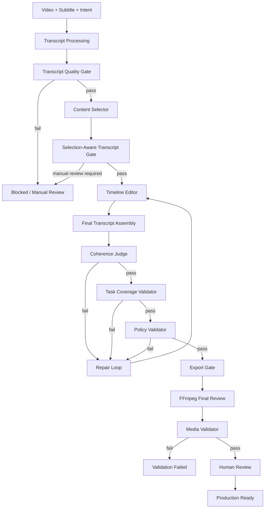
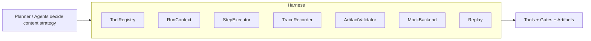

# ClipPilot-Agent

ClipPilot-Agent is a **Multi-Agent Editing Workflow Harness** for long-form video rough cuts.

It takes a source video, an optional VTT/SRT subtitle file, and a natural-language editing intent, then coordinates a transcript layer, multiple LLM editing agents, quality gates, FFmpeg export, trace logging, replay, and human review artifacts.

This is not a benchmark-leading video summarization model, not a professional NLE, and not a system that automatically produces publish-ready videos. Its value is workflow control: it can make a first-cut review video when the inputs and timeline pass validation, and it can also block bad outputs such as poor transcripts, fragmented timelines, one-segment degenerate repairs, overlong plans, black-screen media, or files that exist but do not satisfy the task.

## 1. Project Goal

Single-LLM video editing pipelines often fail in boring but important ways:

- the transcript is incomplete or garbled;
- clips start or end mid-sentence;
- timeline segments jump between unrelated topics;
- repair loops delete difficult content until only one coherent but insufficient segment remains;
- exported files exist but are black, silent, overlong, or not explainable by a timeline;
- automated scores are mistaken for human acceptance.

ClipPilot-Agent addresses these as an engineering workflow problem. It separates content selection, timeline editing, judging, repair, export, and validation into auditable steps.

## 2. Architecture





## 3. Layers

**Transcript Layer**

1. Subtitle Loader
2. ASR / External Subtitle
3. LLM Subtitle Refiner
4. Sentence Units
5. Semantic Blocks
6. Editing Units
7. Transcript Quality Gate
8. ASR Risk Detector
9. Selection-Aware Transcript Gate

**Multi-Agent Editing Layer**

1. Content Selector
2. Timeline Editor
3. Final Transcript Assembly
4. Coherence Judge
5. Judge-driven Repair Loop
6. Risk-Coherence Joint Repair
7. Task Coverage Validator
8. Policy Validator

**Harness Layer**

1. ToolRegistry
2. RunContext
3. StepExecutor
4. TraceRecorder
5. ArtifactValidator
6. Mock Backend
7. Replay

**Export Layer**

1. Export Gate
2. Selected Segment Export
3. FFmpeg Normalize / Concat
4. Final Subtitle Remapping
5. Media Validation
6. Human Review Checklist

## 4. Multi-Agent Roles

- **Content Selector** chooses meaningful topics or blocks. It does not cut video.
- **Timeline Editor** turns selected content into a rough-cut timeline. It must preserve sentence/editing-unit boundaries.
- **Coherence Judge** reviews the assembled transcript and returns structured feedback. It does not export video.
- **Repair Loop** sends judge or policy failures back to the editor instead of silently accepting weak timelines.

This separation avoids the pattern where one model generates a result and then implicitly approves its own output.

## 5. Quality Gates

Automatic validation passes only when:

```text
automated_validation_passed =
  transcript_valid
  && selected_scope_lexical_valid
  && content_coherence_valid
  && task_coverage_valid
  && content_sufficiency_valid
  && policy_valid
  && media_valid
```

`production_ready` is never set by the system alone. It requires:

```text
automated_validation_passed == true
and human_review_status == "acceptable"
```

## 6. Inputs and Outputs

Inputs:

- source `.mp4`;
- optional `.vtt` / `.srt`;
- editing intent;
- optional config file.

Primary outputs:

- `final_review.mp4`
- `timeline.json`
- `final_review_transcript.md`
- `validation_report.json`
- `workflow_summary.json`

Supporting outputs:

- `final_review.srt`
- `trace.json`
- `selector_response.json`
- `editor_timeline.json`
- `judge_response*.json`
- `policy_validation_report.json`
- `task_coverage_report.json`
- `export_gate_decision.json`
- `human_final_review_checklist.md`

Intermediate assets such as `selected_segments/`, `normalized_segments/`, `temp_chunks/`, subtitle previews, and repair rounds are not final user deliverables.

## 7. Quick Start

Install dependencies:

```powershell
py -3.12 -m pip install -r requirements.txt
```

Configure the LLM API:

```powershell
$env:LLM_API_KEY="your_key"
$env:LLM_BASE_URL="https://api.deepseek.com"
```

Dry-run with a provided subtitle:

```powershell
py -3.12 scripts/run_workflow.py `
  --video data/raw/eduvsum/AnnotatedVideosAndSubtitles_version_1/Advanced_CPU_Designs__Crash_Course_Computer_Science_9_-_English_csyt.mp4 `
  --subtitle data/raw/eduvsum/AnnotatedVideosAndSubtitles_version_1/en_Advanced_CPU_Designs__Crash_Course_Computer_Science_9_-_English_csyt.vtt `
  --intent "Create a coherent first-cut review video for students. Keep key concepts, avoid fragmented jumps, and prepare artifacts for human review." `
  --out outputs/demo_run `
  --config configs/config.good_vtt_demo.yaml
```

Export video only when gates allow it:

```powershell
py -3.12 scripts/run_workflow.py `
  --video path/to/video.mp4 `
  --subtitle path/to/subtitle.vtt `
  --intent "Create a coherent first-cut review video for students." `
  --out outputs/demo_run `
  --export-video
```

Replay trace summary:

```powershell
py -3.12 scripts/replay_run.py --trace outputs/demo_run/trace.json
```

Validate an existing run:

```powershell
py -3.12 scripts/validate_run.py --run-dir outputs/demo_run
```

Run tests:

```powershell
py -3.12 -m compileall src scripts
py -3.12 -m pytest tests/ -q
```

## 8. Cases

- Success case: `docs/cases/success_case_good_vtt.md`
- Failure interception case: `docs/cases/failure_case_physics_asr.md`

The failure case is important: the exported media was playable, had audio, and was not black, but the final timeline collapsed to a single 20-second segment. Task Coverage Gate marked it invalid. This demonstrates why media validity is not product success.

## 9. Evidence

Current evidence is engineering evidence, not a claim that the generated videos are better than a benchmark system.

- Automated tests cover Harness behavior, trace/replay contracts, repair loops, gates, media validation, and output contracts.
- Good VTT case: transcript, coherence, policy, and media gates can allow a valid first-cut export flow.
- Bad ASR case: transcript quality and lexical-risk gates can block or narrow unsafe editing scope.
- Judge failed -> Editor repair -> Judge re-check is represented in the repair-loop artifacts.
- Policy overflow, such as a 619s rough cut under a 240s policy, is treated as a policy violation that requires repair or blocking.
- Black-screen or visually invalid media is rejected by Media Gate.
- A 20-second single-segment degenerate output is rejected by Task Coverage Gate even when media is valid.
- Small-scale rule / single-agent / multi-agent comparison scaffolding lives in `eval/`; human review remains pending until a person fills the blind review sheet.

| Case | Transcript | Coherence | Coverage | Policy | Media | Final Result |
| --- | --- | --- | --- | --- | --- | --- |
| Good VTT | Pass | Pass | Pass | Pass | Pass | Exported / review-ready |
| Bad ASR | Fail or risky | - | - | - | - | Blocked or manual review |
| Incoherent timeline | Pass | Fail -> Repair | Pass | Pass | Pass | Re-evaluated |
| Policy overflow | Pass | Pass | Pass | Fail -> Repair | Pass | Re-evaluated |
| Black video | Pass | Pass | Pass | Pass | Fail | Blocked |
| Degenerate clip | Pass | Pass | Fail | Pass | Pass | Blocked |

## 10. Tests

The current automated test suite covers schemas, Harness behavior, transcript gates, multi-agent repair, policy gates, media validation, task coverage, UTF-8 checklist output, and output contracts.

Current result: `107 passed` before adding the evaluation scaffold; run `py -3.12 -m pytest tests/ -q` for the latest count.

This test result validates engineering behavior and gates. It does not prove video content quality is better than another algorithm.

## 11. Limitations

- Transcript quality is still a major dependency.
- Chinese ASR errors can shrink or block the usable editing scope.
- Risk avoidance can reduce narrative completeness.
- LLM judges are useful proxy checks, not human review.
- First-cut review videos are not publish-ready edits.
- Multi-agent workflows increase latency and API cost.
- Current cases are limited and do not establish benchmark superiority.
- OCR and multiple ASR backends remain extension points.

## 12. Project Boundary

ClipPilot-Agent is:

- an LLM-driven rough-cut workflow harness;
- a traceable multi-agent editing pipeline;
- a gate-based validation system for review-ready artifacts.

It is not:

- a video generation model;
- an end-to-end trained video summarization model;
- a replacement for human editors;
- a system that claims public benchmark or production-level superiority.
