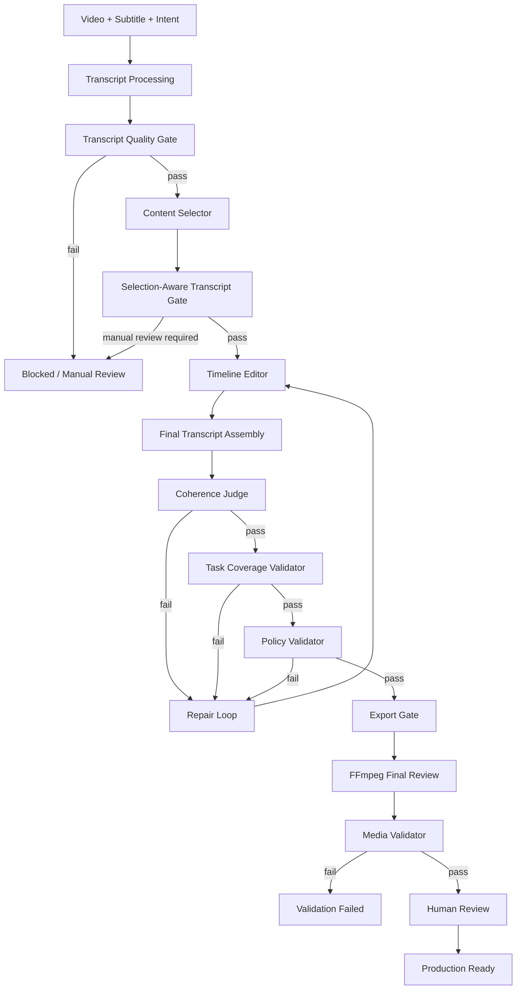
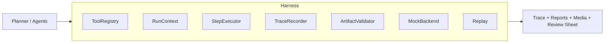

# System Design

ClipPilot-Agent is a Multi-Agent Editing Workflow Harness for long-form video rough cuts. The system is designed to produce auditable first-cut artifacts and to block invalid results before they are mistaken for successful products.

## Main Flow



## Transcript Layer

The transcript layer turns raw subtitles or ASR output into editing-safe structures:

1. Subtitle Loader
2. ASR / External Subtitle
3. LLM Subtitle Refiner
4. Sentence Units
5. Semantic Blocks
6. Editing Units
7. Transcript Quality Gate
8. ASR Risk Detector
9. Selection-Aware Transcript Gate

Sentence Units preserve timing boundaries. Semantic Blocks and Editing Units provide higher-level context for selection and editing.

## Multi-Agent Editing Layer

- Content Selector selects meaningful topics or block groups.
- Timeline Editor organizes selected content into a rough-cut sequence.
- Final Transcript Assembly renders the proposed timeline as text.
- Coherence Judge reviews the transcript for context loss, topic jumps, and fragmented cuts.
- Repair Loop sends structured feedback back to the Timeline Editor.
- Risk-Coherence Joint Repair balances transcript risk and storyline completeness.
- Task Coverage Validator checks whether the user intent is still satisfied.
- Policy Validator checks duration, segment count, and plan constraints.

## Harness Layer



The Harness controls execution, not content strategy. It records state, dispatches tools, writes trace events, runs gates, validates artifacts, and supports replay/debugging.

## Export Layer

Video export is gated and explicit. `final_review.mp4` is generated only after transcript, coherence, coverage, policy, and export gate checks allow it. FFmpeg is used for segment export, normalization, concat, and subtitle remapping. Media validation checks decodability, audio, black frames, frozen frames, and timeline duration alignment.

## Final Pass Condition

```text
automated_validation_passed =
  transcript_valid
  && selected_scope_lexical_valid
  && content_coherence_valid
  && task_coverage_valid
  && content_sufficiency_valid
  && policy_valid
  && media_valid
```

`production_ready=true` additionally requires human review:

```text
human_review_status == "acceptable"
```
